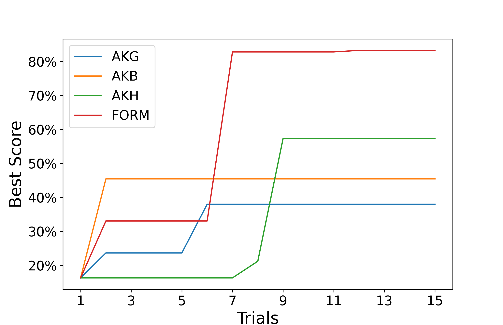
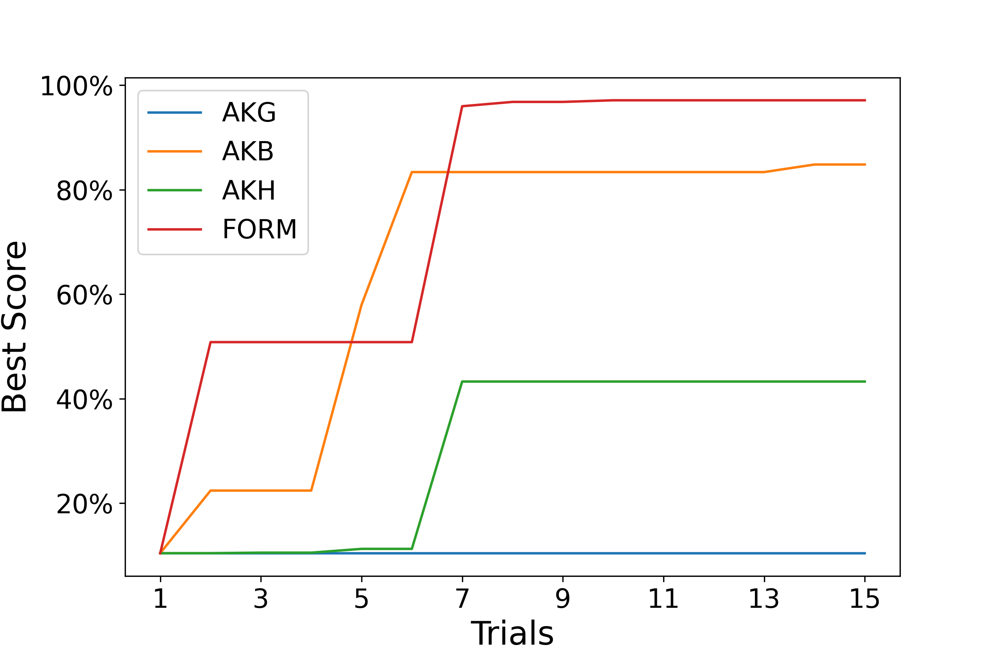

# FORM

## TL;DR

A feedback-based model search system to find well-performance models on given
tasks in several hours and trials.

*Our system is still a prototype, we will continue to optimize and improve this system.*

## Repo Structure

```
- FORM/                 
    - AutoKeras/
    - Test_dir/  
        - demo_origin/
        - demo_result/
    - utils/         
    - copy_file.sh            
    - demo.py                  
- Motivation/                      
- ExperimentResults/                      
    - SearchResults15Trials/
- README.md
- requirements.txt
```

## Setup
To install all dependencies, please get into this directory and  run:

```bash
$ pip install-r requirements.txt
```

In addition, since our system is currently implemented based on Auto-Keras, you
need to change the `your_lib` in `copy_file.sh` to the path of Auto-Keras lib in
your environment, and modify the `form_dir` to the path of `AutoKeras` in this
directory. Then

```bash
$ cd ./FORM
$ chmod +x ./copy_file.sh
$ ./copy_file.sh
```

In addition, in order to record feedback in parallel in the current version
implementation, you also need to write the path of your python interpreter in
`write_algw` [line 408](./FORM/utils/load_test_utils.py),
`get_gradient`[line78](./FORM/AutoKeras/engine/tuner.py),[line
90](./FORM/utils/operation_test_utils.py).

## Usage
It is easy to use *FORM* to search models. 
When the environment configuration in `Setup` is finished, you can use *FORM* to
search models directly by using `greedy` tuner in `autokeras.ImageClassifier()`.
To show our method intuitively, we provide a demo case in
[demo.py](./FORM/demo.py), which is based on the CIFAR-100 dataset.
You can just run [demo.py](./FORM/demo.py) to see how *FORM* search models based
on feedback data.
In addition, you can also specify the parameters in this code to customize the
search process. We have made necessary comments on the code for easy understanding.

``` bash
$ $ cd ./FORM
$ python demo.py
```

## Experiment Results

### Effectiveness

To evaluate the effectiveness and *FORM*, we conduct comparative experiments
with a total of 18 searches on 4 datasets with each search method (i.e., Greedy,
Bayesain, Hyperband search methods in Auto-Keras and the feedback-based search in *FORM*).
In this experiment, we observe whether FORM can obtain better models in the limited
time (i.e., 4 hours, only stl-10 dataset search for 2 hours), and the results
are shown in this
[table](./ExperimentResults/Effectiveness/effectiveness_table.tsv).

The results show that *FORM* is effective in searching models
on given tasks and obtains better search results than other search
methods.
*FORM* achieves an average score of 90.87% on all
searches, which is significantly better than the score of other baselines (i.e.,
59.90% in Greedy, 73.85% in Bayesian, 81.48% in Hyperband).


### Efficiency





To evaluate the search efficiency gain from the feedback-based search of \sys, we
conduct 18 searches with each search method on 4 datasets and evaluate
whether *FORM* can really find better models in limited number of search
trials (i.e., 15 trials).

The results demonstrate that *FORM* is efficient in search well-performance models
on given tasks in limited search attempts.
It achieved an average score
of 91.40\% in a total of 18 searches on 4 datasets. In contrast, Greedy, Bayesian,
and Hyperband search methods only obtain 58.06\%, 73.48\%, and 69.28\%
respectively.

The above figures show 2 cases of experiment result on CIFAR-100 dataset and
STL-10 dataset.

## Reproduction

Our experiment results on 4 datasets is saved in [here](https://drive.google.com/file/d/1_ngnpSQxNEKLoQnfzZp6eutgRMO0lfIp/view?usp=sharing). It contains the initial model
architecture for the searches and the search results of each search method in
experiments (the subdir 'Our' in it shows the results of `FORM`).
It is worth mentioning that, due to the large size of models, we only save parts
of the best models in the data.
The rest of the models are saved as the parameter files like `best_param.pkl`, you can use [this code](./ExperimentResults/reproduct_models_from_parameters/reproduce_experiment_model.py) to generate those models.

The search priority of all available actions in current version `FORM` for different conditions are saved in [this
file](./FORM/utils/priority_pure.pkl), you can use the `pickle`
lib in python to load it.

In addition, we also share the search log of the experiment with Bayesian search
method and `FORM` in
Motivation [here](./Motivation/accuracy_log.pkl). You can also use the `pickle` to load it.
It shows the best val_accuracy in 100 trials of the search process by Bayesian
method.
The code we used to obtain the Bayesian method results is shown
[here](./Motivation/motivation.py). And you can use [this code](./FORM/demo.py)
to reproduce our search result. The best models searched by two methods in
Motivation is shown in the same link with our expeirment results.

If you want to reproduce our experiment, you can use the
[demo.py](./FORM/demo.py) directly.
It is worth mentioning that you need to use `-op` to assign the initial model
architecture as the beginning of the search.
The result will be saved in this [directory](./FORM/Test_dir/demo_origin) and
the [log](./FORM/Test_dir/demo_origin/log.pkl) will also save there.